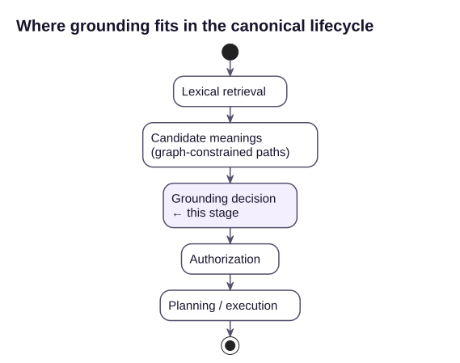

# Grounding decisions

[Lexical grounding](LEXICAL-GROUNDING.md) answers one question: _can these
tokens be mapped onto a legal path through the semantic contract?_

That is a narrower question than grounding actually requires, and answering
only that one creates a specific failure mode: **a candidate that fits the
graph is not necessarily the meaning the user intended.** A semantically
valid path is evidence that an interpretation is _possible_. It is not
evidence that it is the _intended_ one, and a resolver that always returns
the top-scored path will occasionally authorize and execute a confidently
wrong interpretation instead of failing loudly.

`SemanticLexicalResolver.Ground` exists to make that distinction explicit
instead of silently collapsing it.

## The problem in one example

Given a schema where a `Customer` has both an account status and an order
history, the expression:

```text
active customers
```

is genuinely ambiguous. All of the following are structurally valid:

- a customer whose account is currently enabled;
- a customer with a transaction in the last 30 days;
- a customer with an open subscription.

Every one of those produces a legal semantic path. Retrieval score alone
cannot tell you which one the caller meant, and **authorization does not
solve this either** — a request built from the wrong interpretation is
still a fully authorized request. It is a perfectly authorized
misunderstanding.

The graph is good at rejecting nonsense. On its own, it cannot reject a
plausible mistake.

## Two kinds of "more than one candidate"

`Ground` does not treat every case with more than one graph-legal path as
ambiguous. It separates two situations that look identical at the level of
"multiple candidates came back" but are not the same problem:

1. **Different evidence for the same meaning.** Two retrieval sources (say,
   a fuzzy/BM25 index and a `pgvector` index) both proposed the same
   relationship, or the graph search found two different bridging routes to
   the same field. The _meaning_ is identical; only the supporting evidence
   or the mechanical route differs. This is retrieval noise, not ambiguity,
   and should not block execution.
2. **Different meanings.** Two candidates map the same token onto a
   different field, value, relationship, or root entity. `active` resolving
   to `Customer.AccountEnabled` in one candidate and to
   `Customer.HasRecentOrder` in another is not a routing detail — a customer
   can be true for one and false for the other. This is a competing
   interpretation, and picking one silently means guessing on the caller's
   behalf.

`Ground` tells these apart with a **signature**: the token-by-token mapping
onto the contract (kind, entity, field, relationship, value), independent of
score and independent of which bridging path the graph search happened to
use to get there. Paths with the same signature are the same interpretation
and are collapsed into one, keeping the strongest evidence. Paths with
different signatures are competing interpretations, and only get collapsed
into a single answer when one clearly dominates on confidence.

## The result: `GroundingDecision`

```csharp
public enum GroundingOutcome : byte
{
    Committed,               // one interpretation, or several that agree on meaning
    RequiresClarification,   // two or more interpretations disagree on meaning
    Unresolved,              // no legal interpretation existed at all
    BudgetExceeded           // a resource limit stopped the search before it could prove uniqueness
}

public enum GroundingBudgetLimit : byte
{
    None,
    MaxTokens,
    MaxPathsExplored,
    Timeout,
    RetrievalTimeout,
    Cancelled
}

public sealed record GroundingInterpretation(
    IReadOnlyList<SemanticLexicalStep> Steps,
    double InterpretationScore,
    EntityId RootEntity,
    string Signature);

public sealed record GroundingDecision(
    string Expression,
    GroundingOutcome Outcome,
    GroundingInterpretation? Committed,
    IReadOnlyList<GroundingInterpretation> CompetingInterpretations,
    string Reason,
    IReadOnlyList<SemanticLexicalCandidate> RootCandidates,
    GroundingBudgetLimit BudgetLimit = GroundingBudgetLimit.None,
    IReadOnlyList<GroundingInterpretation>? PartialInterpretationsAtCutoff = null);
```

`GroundingDecision` is deliberately a first-class, inspectable object rather
than a boolean or a single winning path. It is meant to be logged, displayed,
or escalated:

- `Committed` is the interpretation Foundgine is willing to authorize —
  `null` when clarification is required.
- `CompetingInterpretations` holds every semantically distinct reading that
  was still in contention, each with its own steps, confidence, and lexical
  evidence — not just the runner-up's score, but _why_ it was a legitimate
  alternative.
- `Reason` explains the outcome in terms a caller, a log line, or a
  clarifying question can use directly.

## Example

```csharp
var resolver = new SemanticLexicalResolver(contract, candidateSource);
var decision = resolver.Ground("active customers");

switch (decision.Outcome)
{
    case GroundingOutcome.Committed:
        // decision.Committed.Steps carries the same path information
        // SemanticRequestResolver expects — proceed to authorization/planning.
        break;

    case GroundingOutcome.RequiresClarification:
        // decision.CompetingInterpretations describes each candidate meaning.
        // Surface it back to the caller instead of guessing:
        //   "active" could mean an enabled account or a recent order —
        //   which did you mean?
        break;

    case GroundingOutcome.Unresolved:
        // decision.Reason names the token that had no legal candidate.
        break;
}
```

`GroundingOutcome.RequiresClarification` is not a failure state to be routed
around — it is the correct answer when the expression genuinely does not
determine one meaning. Treating it as first-class output, rather than
resolving it away with "pick the highest score," is what keeps a perfectly
authorized execution from becoming a perfectly authorized misunderstanding.

## A third failure mode: `BudgetExceeded`

`Unresolved` and `RequiresClarification` both assume the search finished —
it explored everything and either found nothing legal, or found more than
one legal meaning. `BudgetExceeded` is a different kind of failure: the
search was stopped by a configured resource limit (token count, total
search work, a search-time or retrieval-time wall clock, or a cancelled
`CancellationToken`) before it could finish enumerating every candidate
interpretation.

That distinction matters because a partial search is not evidence of a
single meaning. If grounding stopped early and just happened to have found
one interpretation so far, treating that as `Committed` would silently
reintroduce the exact "perfectly authorized misunderstanding" this whole
mechanism exists to prevent — the search simply never got the chance to
find the second, competing interpretation that would have forced
`RequiresClarification`. So `BudgetExceeded` always carries `Committed =
null`, the same as `Unresolved`, and `GroundingDecision.BudgetLimit`
records exactly which control fired.

Whatever interpretations the search _had_ constructed before the limit
tripped are still exposed, via `PartialInterpretationsAtCutoff` — but
strictly as a diagnostic. It exists so an operator can see "grounding
found 2 partial candidates before hitting `MaxPathsExplored`, maybe raise
the budget" without that data ever being mistaken for an authorizable
answer. Nothing in Foundgine reads this field to decide what to execute.

See [Lexical grounding § Complexity bounds](LEXICAL-GROUNDING.md#complexity-bounds)
for the full set of controls and their defaults.

## `Resolve` versus `Ground`

`SemanticLexicalResolver.Resolve` still exists, and is implemented on top of
`Ground`, for callers that only need a single best-effort path and are
willing to treat `SemanticLexicalResolutionOutcome.Ambiguous` as a stop
signal. It answers "what is the top candidate, and is it clearly the only
one" — `Ground` is preferred whenever the caller can act on more than a
yes/no about ambiguity, since it explains what the competing meanings
actually were instead of only signalling that a tie existed.

## Where this fits in the canonical lifecycle

<p align="center"></p>


Grounding is not a replacement for authorization, planning, or provider
execution — it runs before all of them, and it is scoped narrowly: deciding
whether the lexical layer is justified in committing to one meaning of a
free-form expression before that meaning is handed to the rest of the
pipeline. A `Committed` decision still goes through ordinary semantic
resolution, authorization, and provider-independent planning exactly as
before; nothing about authorization or execution security changes. What
changes is that an expression is no longer allowed to reach authorization
carrying an unacknowledged coin-flip between two different meanings.

## What this does not claim to solve

This is deliberately scoped to _structural_ ambiguity — cases where the
frozen semantic contract itself admits more than one legal mapping for the
same tokens. It does not attempt to resolve ambiguity using conversational
context, user history, or an LLM's judgment about which interpretation
"looks right"; doing so would just move the uncertainty around instead of
surfacing it. Building a mechanism that also incorporates contextual
evidence, calibrated confidence, and a measurable clarification/false-
commitment rate — the fuller "Grounding Decision" object described in the
project's design discussions — remains future work; see
[Roadmap](ROADMAP.md).

Two further gaps are worth stating explicitly rather than leaving implicit:
there is currently no candidate kind for a domain-specific value threshold
(a request like "big accounts" fails closed as `Unresolved` rather than
inferring a cutoff), and there is no temporal candidate kind at all (a
relative date reference like "last summer" also fails closed rather than
being silently dropped from the interpretation). Both are real,
currently-unimplemented gaps, not edge cases this mechanism quietly
handles — see
[Lexical grounding § Adversarial examples](LEXICAL-GROUNDING.md#adversarial-examples-where-this-gets-hard)
for the worked-through failure behavior and [Roadmap](ROADMAP.md) for the
tracked future work.

---

Previous: [Lexical grounding](LEXICAL-GROUNDING.md) · Next: [Authorization](AUTHORIZATION.md)

> **Disclosure boundary:** `CompetingInterpretations` is an internal semantic result. Do not expose its
> semantic metadata directly to untrusted callers unless the application has determined that the metadata
> is disclosure-safe. Prefer a sanitized clarification projection at the runtime/application boundary.
