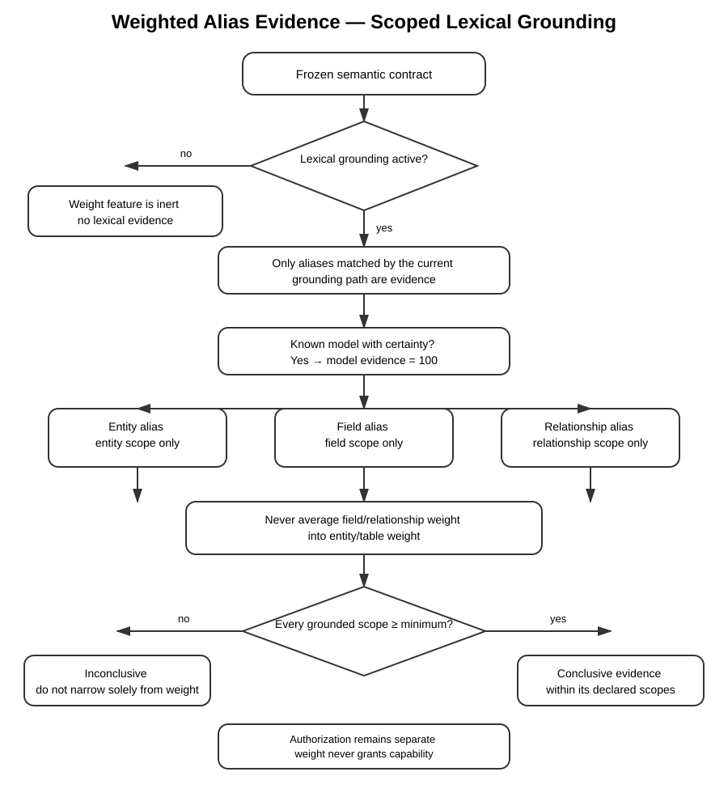

# Lexical grounding

Foundgine can resolve free-form language without requiring complete sentences or
predefined query templates. The semantic contract remains authoritative; an
approximate retrieval provider only proposes candidates.

## Canonical flow

<p align="center"></p>


For each token, the retrieval boundary can consider:

- Entity
- Node
- Relationship
- Traversal
- Field
- Value
- Operation

The highest retrieval score is the **first hypothesis**, not truth. A lower
scoring candidate can win if it forms a valid semantic path while the higher
scoring candidate cannot.

### Weighted aliases: evidence strength without authority

Aliases can optionally carry an **evidence weight from 1 to 100**. The weight is
now part of the grounding evidence model, while remaining separate from the
retrieval/graph interpretation score.

The resolver has one explicit policy switch:

```csharp
new SemanticLexicalResolver(
    contract,
    source,
    minimumAliasWeight: 80);
```

When `minimumAliasWeight` is omitted, alias weights are measured and exposed as
diagnostic evidence but do not change commitment. When it is configured,
retrieval/graph score still determines which interpretation ranks first; the
alias weight does **not** participate in that ranking equation. Instead, the
selected interpretation must satisfy the configured lexical-evidence threshold
before Foundgine may commit it.

The resulting flow is:

```text
lexical candidate
    ├── retrieval score
    ├── matched alias evidence
    └── semantic identity
             ↓
      interpretation
    ├── InterpretationScore
    └── AliasEvidence
             ↓
      GroundingDecision
       ├── Committed
       └── RequiresClarification
```

A unique interpretation with a declared alias below the configured minimum is
therefore **not committed**. The decision exposes the measured alias evidence
and returns `RequiresClarification`. This is a grounding commitment policy,
not an authorization decision.

There are three independent evidence scopes, plus one distinct provenance
signal:

- **Model provenance** — if the model has already been established with
  certainty by an earlier processing step, Foundgine records this as
  `ModelResolutionEvidence.KnownWithCertainty`, a distinct non-numeric
  category rather than a value on the same 1–100 scale as alias weight. This
  is deliberate: model certainty and declared alias evidence answer different
  questions, so they cannot be combined (e.g. via `max`) even by accident. An
  obsolete `ModelWeight` (`int?`, `100` when known-with-certainty) remains
  only as a compatibility projection for existing callers.
- **Entity scope** — an entity alias contributes only to that entity.
- **Field / relationship scope** — a field alias contributes only to that field,
  and a relationship alias only to that relationship.

A field weight of `50` is therefore **not** a `50` for its containing entity.
Likewise, a relationship weight cannot raise the entity's evidence.

If several weighted aliases contribute to the same semantic identity in one
grounding interpretation, the aggregation rule is **maximum declared weight**.
Repeated retrieval evidence does not inflate the value, and a weaker alias
cannot dilute a stronger alias for the same identity.

The evidence API uses an explicit three-state status:

```csharp
AliasEvidenceStatus.NotApplicable
AliasEvidenceStatus.Sufficient
AliasEvidenceStatus.Insufficient
```

`NotApplicable` means that no weighted lexical alias participated. It does
**not** mean that the request was positively proven. The older
`IsConclusive` boolean remains only as a compatibility projection and should
not be used by new callers.

Every evidence result also carries `ContractFingerprint` — the fingerprint of
the exact frozen semantic contract it was measured against, computed from
declarations _and_ their declared alias weights. Changing a declared alias
weight changes the contract's fingerprint, since weight is security-relevant
evidence rather than decorative metadata. This lets an audit trail prove
which contract version a `Sufficient`/`Insufficient` verdict corresponds to.

The weight can be declared on an entity, field, or relationship alias:

```csharp
[FoundgineAlias("Vendor", Weight = 95)]
[FoundgineAlias("Seller", Weight = 90)]
public sealed record Supplier(...);

[property: FoundgineAlias("State", Weight = 85)] string Country
```

For applications that use the manual semantic builder, the equivalent APIs are
`Alias("Vendor", 95)`, `FieldAlias(..., "State", 85)`, and
`RelationshipAlias(..., "vendor", 85)`.

The frozen semantic contract builds case-insensitive alias indexes for entity,
field, and relationship declarations. Grounding therefore does not repeatedly
scan the entire semantic model to recover evidence.

Weight remains evidence about vocabulary, not authority. It never grants a
capability and never replaces the authorization boundary.



PlantUML source: [`lexical-grounding-alias-weight.puml`](assets/lexical-grounding-alias-weight.puml)

The advanced Supply Chain sample exercises entity, field, and relationship
alias weights, including scope boundaries and the distinction between lexical
grounding and already-known semantic models. The resolver tests additionally
cover the important disagreement case: a high retrieval score cannot bypass a
configured low alias-evidence threshold.

The important distinction is:

| Signal                 | Meaning                                                                            | Can it grant authority?                  |
| ---------------------- | ---------------------------------------------------------------------------------- | ---------------------------------------- |
| Retrieval score        | How strongly a provider matched a token; used to rank interpretations              | **No**                                   |
| Alias weight           | Application-declared evidence strength for a matched lexical declaration           | **No**                                   |
| Interpretation score   | Retrieval/graph heuristic used to rank complete meanings                           | **No**                                   |
| Alias evidence policy  | Whether the selected interpretation has enough declared lexical evidence to commit | **No**                                   |
| Semantic path          | Whether a candidate interpretation is structurally legal                           | **No**                                   |
| Authorization decision | Whether the caller may execute the resolved operation                              | **Yes — this is the authority boundary** |

## Elasticsearch

`Foundgine.Providers.Storage.Elasticsearch` is optional. It projects a frozen
`SemanticContractSnapshot` through `SemanticLexiconProjection` and retrieves
ranked candidates through Elasticsearch BM25/fuzzy matching.

The index contains structural documents for entities, nodes, fields and
relationships. Domain values such as `Nike` and `Shoes` are separate value
documents because they are data vocabulary, not structural declarations.

Elasticsearch relevance `_score` is never treated as a probability. Foundgine
combines retrieval relevance with semantic graph compatibility and path
continuity before accepting an interpretation.

## PostgreSQL (pgvector)

`Foundgine.Providers.Storage.PostgresVector` is optional and implements the same
`ISemanticLexicalCandidateSource` boundary as `Foundgine.Providers.Storage.Elasticsearch`. It
projects a frozen `SemanticContractSnapshot` through the same
`SemanticLexiconProjection`, embeds each entry with a caller-supplied
`ISemanticEmbeddingGenerator`, and stores the vectors in a PostgreSQL table
via the `pgvector` extension. Candidate retrieval ranks by cosine (or L2, or
inner-product) distance instead of BM25.

pgvector distance is converted to a bounded relevance score the same way
Elasticsearch's `_score` is used: as a retrieval hypothesis, never a
probability and never an authorization decision. The projected table is not
Foundgine's semantic memory — it is a derived, disposable retrieval index.
Aliases/synonyms, graph neighbors, and embeddings are three separate
concerns; only the frozen semantic contract is authoritative for the first
two.

Because both providers implement the same interface, a deployment can run
either one, or combine candidates from both before handing them to
`SemanticLexicalResolver`.

## Not to be confused with: field-value retrieval (`IApproximateCandidateSource`)

Everything above — Elasticsearch, pgvector, `SemanticLexicalResolver` — is
one specific boundary: `ISemanticLexicalCandidateSource`, which matches
**vocabulary**. Given the token `nike`, it answers "which schema entity or
field does this _word_ mean?" (`CatalogProduct.Name`, in the worked example
below).

`Foundgine.Providers.Storage.Sql.Retrieval.PostgresRetrievalCandidateSource`
implements a different boundary, `IApproximateCandidateSource`, which
matches **data**. Given the string `"Acme Suplies"`, it answers "which
_row_ is this closest to?" — via `RetrievalStrategy.Fuzzy` (`pg_trgm`),
`FullText` (native Postgres), `Search` (pg_search/BM25), or
`GraphSimilarity` (Apache AGE). See `docs/ARCHITECTURE.md`'s retrieval
paragraph, and `src/csharp/samples/Foundgine.SupplyChain.Advanced/docs/04-Retrieval-Strategies.md`
for a worked, tested case per strategy against a real schema — including
`find_top_supplier_overdue_orders`'s own scoped use of `Fuzzy`/`FullText`/
`Search` to turn a misspelled `supplierName` into a "did you mean"
`clarification_needed` instead of a flat `not_found`.

Both boundaries produce _candidates and evidence, never authority_ — the
same rule this document states above ("The highest retrieval score is the
first hypothesis, not truth") applies equally to a fuzzy-matched row as to
a fuzzy-matched vocabulary token. But they answer genuinely different
questions, and nothing in Foundgine currently connects them: there is no
code path where a data-value match from `PostgresRetrievalCandidateSource`
becomes a `SemanticLexicalCandidate` fed into `Ground`. A future provider
that unifies "the word looks like X" and "the value looks like Y" into one
retrieval pass is a reasonable extension, not something either boundary
does today.

## Example

Given:

<p align="center"></p>


and a lexical expression:

```text
bought nike shoes
```

Elasticsearch can return candidates such as:

<p align="center"></p>


Foundgine then validates the path:

<p align="center"></p>


The database is queried only after this semantic interpretation has been
resolved and authorized. It does not decide what the words mean.

## Adversarial examples: where this gets hard

`bought nike shoes` is a demonstration, not evidence that ambiguity is
solved — every token happens to have exactly one plausible reading. A
resolver that only had to handle friendly inputs like this would be
feature theater. The cases below are harder, and Foundgine's behavior on
each is deliberate rather than best-effort.

**`customers with big accounts`.** There is no candidate kind for a
business threshold like "big" — it is not a field, value, relationship, or
entity in the semantic contract unless the domain model has explicitly
declared one (e.g. a `HighValueAccount` flag or a named `AccountTier`
value). Without that, retrieval returns zero candidates for the token
`big`, and grounding reports `GroundingOutcome.Unresolved` with the reason
naming the exact token that had no candidate. Foundgine does not infer a
number (`> €10k`? top 10%?) to make the query runnable — inventing a
threshold the caller never stated would be a worse failure mode than
refusing. If "big account" is a real business concept, it belongs in the
semantic contract as a named field or value, not as something the lexical
layer guesses at query time.

**`Nike customers who bought running shoes last summer`.** `bought`,
`nike`, and `shoes` resolve the same way as the simple example. `last
summer` does not: there is currently no temporal candidate kind at all —
`SemanticLexicalCandidateKind` covers Entity, Node, Relationship,
Traversal, Field, Value, and Operation, and none of those represents a
relative date range. Today, a token like `summer` simply returns no
candidates, and the whole expression fails closed with `Unresolved` rather
than silently resolving the entity/product/relationship portion and
dropping the time constraint. That is the correct failure mode — an
unbounded date range executed silently would be a worse outcome than a
visible refusal — but it is a real, currently-unimplemented gap, not a
solved one. See [Roadmap](ROADMAP.md) for temporal grounding as future
work.

**`active customers`.** Both an enabled account and a customer with a
recent order are legal, and neither field is more "correct" than the
other from the graph alone. This is the case `Ground` is built for — see
[the next section](#when-more-than-one-interpretation-is-legal) and
[Grounding decisions](GROUNDING-DECISIONS.md) for the full worked example,
backed by a passing test (`Ground_requires_clarification_when_a_token_maps_to_two_different_fields_with_tied_confidence`
in `SemanticLexicalResolverTests`).

The useful benchmark for this feature is not "can it resolve a friendly
expression" — it is "can it correctly refuse an ambiguous or
under-specified one instead of confidently executing a guess." All three
examples above are refusals, and each is a distinct kind of refusal:
missing vocabulary (`big`), missing capability (`last summer`), and
genuine tied meaning (`active`).

## Complexity bounds

The canonical flow reads as `tokens × semantic kinds × candidates × paths
× backtracking`, and read naively that is a combinatorial search space.
`SemanticLexicalResolver` bounds it explicitly, in code, not just in
philosophy:

| Control                        | Constructor parameter                     | Default | What it bounds                                                                                                                                                                                                                                                         |
| ------------------------------ | ----------------------------------------- | ------- | ---------------------------------------------------------------------------------------------------------------------------------------------------------------------------------------------------------------------------------------------------------------------- |
| Tokens per expression          | `maxTokens`                               | 32      | Input size — checked before any retrieval or search runs, since token count is the dominant term in worst-case branching (`candidateLimit ^ tokenCount` before graph-legality pruning).                                                                                |
| Candidates per token           | `candidateLimit`                          | 20      | Branching factor at each token.                                                                                                                                                                                                                                        |
| Bridging hops per transition   | `maxBridgeHops`                           | 4       | Graph depth the BFS will traverse to connect a candidate back to the current entity.                                                                                                                                                                                   |
| Total search work              | `maxPathsExplored`                        | 5,000   | A single shared budget across every DFS node expansion _and_ every bridging-BFS dequeue for one `Ground` call — this is what actually bounds total work regardless of how permissive the candidate source or how densely connected the entity graph is.                |
| Wall-clock ceiling (search)    | `timeout`                                 | 250ms   | An independent guard against a large in-memory search tree. Starts counting only after candidate retrieval has completed.                                                                                                                                              |
| Wall-clock ceiling (retrieval) | `retrievalTimeout`                        | 2s      | Candidate retrieval for every token happens entirely before the search-time budget above starts counting — this bounds that separate stage, so a slow or hung candidate source (network partition, slow index) fails closed instead of blocking `Ground` indefinitely. |
| Cooperative cancellation       | `CancellationToken` on `Ground`/`Resolve` | —       | Lets a caller abort a specific request, during either retrieval or search, without waiting for a timeout.                                                                                                                                                              |

"Maximum backtracking branches" is not a separate, independently tunable
control: every backtrack is a DFS re-entry, so it consumes the same shared
`maxPathsExplored` budget as forward search. There is currently no cap on
backtracking distinct from total search work.

Every one of these fails closed. Hitting any limit — including a cancelled
token — returns `GroundingOutcome.BudgetExceeded` (`Committed = null`,
`CompetingInterpretations` empty), never a partial answer built from
whatever the search happened to find before it was cut off:

<p align="center"></p>


This is a deliberate design choice, not an incidental one: a search
stopped by a resource limit has not proven there is only one legal
interpretation, so treating its partial output as if it had would
reintroduce exactly the "perfectly authorized misunderstanding" that
`Ground` exists to prevent. `GroundingDecision.BudgetLimit` names which
control fired (`MaxTokens`, `MaxPathsExplored`, `Timeout`,
`RetrievalTimeout`, or `Cancelled`), so it can be logged, alerted on, or
tuned per deployment without parsing `Reason` text. Deterministic
tie-breaking for equally-scored candidates is handled separately from the
budget: ties are broken by `CanonicalName` ordinal comparison, so a
re-run of the same expression against the same contract and candidate
set always produces the same result.

On `BudgetExceeded`, `GroundingDecision.PartialInterpretationsAtCutoff`
exposes whatever interpretations the search had already constructed when
the limit fired — useful for logging, alerting, or deciding whether to
raise a budget and retry. This is diagnostic only: a partial search is
not proof of a unique legal meaning, so `Committed` stays null regardless
of what this list contains, and nothing in Foundgine treats it as
authorizable or executes against it.

## When more than one interpretation is legal

A graph-constrained path answers "is this mapping legal," not "is this
mapping what the caller meant." An expression like `active customers` can
be structurally valid against two different fields at once — an enabled
account and a customer with a recent order are both legitimate readings,
and neither the graph nor a retrieval score can tell them apart on its own.

`SemanticLexicalResolver.Ground` (as opposed to `Resolve`, which only
returns the single best path) surfaces every semantically distinct
interpretation that was still legal, distinguishes that from two pieces of
evidence for the _same_ interpretation, and refuses to silently pick a
winner when genuinely different meanings remain tied. See
[Grounding decisions](GROUNDING-DECISIONS.md) for the full explanation, the
`GroundingDecision` shape, and a worked example.

---

Previous: [Open Intent API](OPEN-INTENT-API.md) · Next: [Grounding decisions](GROUNDING-DECISIONS.md)
