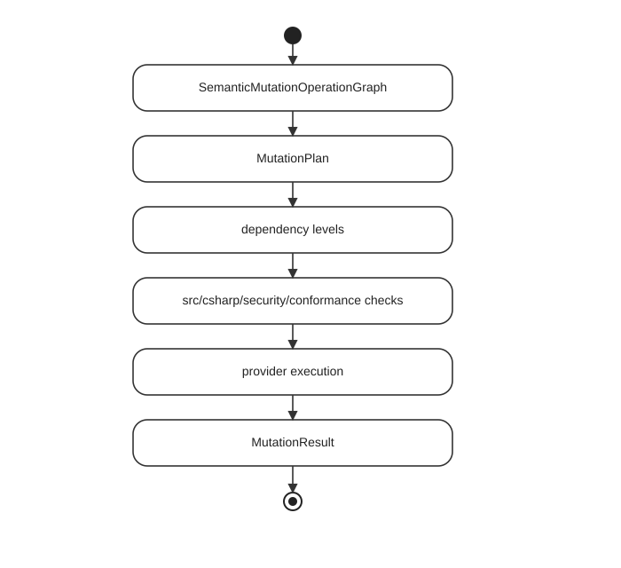

# Runtime

The Foundgine runtime coordinates semantic requests, planning, provider execution, and results.

## Canonical execution lifecycle

Runtime implements the latter half of the canonical lifecycle:

The runtime must not accept an unbound execution artifact. The semantic contract and authorization provenance carried by the plan remain verifiable through provider execution.

## Reads

A normal read follows:

`IFoundgine.ExecuteAsync(...)` is the application-facing boundary.

## Execution context

Execution is request-scoped.

The context may contain:

- security information;
- authorization values;
- provider/request values;
- runtime controls.

Authority-bearing values must originate from the host.

## Provider boundary

`Foundgine.Core.Execution` separates logical plans from provider plans:

This is the point where SQL or another physical representation is allowed.

## Semantic operation lifecycle and plan binding

The runtime consumes a canonical semantic operation graph rather than allowing each adapter to construct its own execution representation.

### Binding invariant

`SemanticPlanAuthorizationBinding` is immutable provenance. It contains the fingerprint of the semantic contract and the fingerprint of the authorization decision that produced the plan.

Planner rewrites must preserve the binding exactly. `ExecutionIRCompiler` refuses to create executable IR without authorization provenance, and the execution boundary verifies that the contract and authorization evidence still match. Provider plans inherit the same binding and cannot execute without a matching provider security proof.

The binding is therefore not a cached permission token. It is a tamper-detection/provenance mechanism connecting:

A different contract, different authorization decision, modified execution IR, transplanted provider plan, or unsatisfied provider security proof must fail closed.

### Plan caching

Provider plan caching may reuse compiled physical structure, but it must not turn a plan into an authorization grant. Request-specific authority remains in the trusted execution context, while the cached artifact retains its semantic/authorization provenance and is revalidated at the execution boundary.

A provider plan cache can sit around compilation.

The safe order is:

The cache must not remove runtime authorization predicates.

## Security conformance

Before execution, required security invariants are compared with provider guarantees.

This protects the semantic contract from a provider that cannot preserve it.

## Results

The runtime distinguishes provider execution from result materialization.

Typical flow:

Adapters such as GraphQL can then shape the result for their own transport.

## Evidence

Execution evidence/receipts can record the execution outcome and relevant src/csharp/security/plan context.

Evidence is diagnostic/audit information. It is not an authorization grant.

## Mutations

Mutation runtime is intentionally separate from reads.

Generated-value dependencies are represented explicitly.

## Cancellation and resource limits

Execution APIs accept cancellation tokens.

Untrusted request complexity is bounded by semantic/security resource limits before expensive provider execution.

Application-level rate limits, quotas, and timeouts remain necessary around Foundgine.

## Runtime non-goals

The runtime does not own:

- authentication;
- user sessions;
- database migrations;
- ORM change tracking;
- LLM orchestration;
- GraphQL hosting;
- MCP transport hosting.

## Custom provider checklist

A provider implementation should prove:

- plan/IR compilation;
- provider execution;
- result materialization;
- cancellation behavior;
- security conformance;
- authorization predicate preservation;
- pagination semantics;
- mutation dependencies if mutations are supported.

See `Foundgine.Core.Execution/README.md` and `Foundgine.Providers.Storage.Sql/README.md` for the provider boundary.

---

Next: [AOT](AOT.md)
