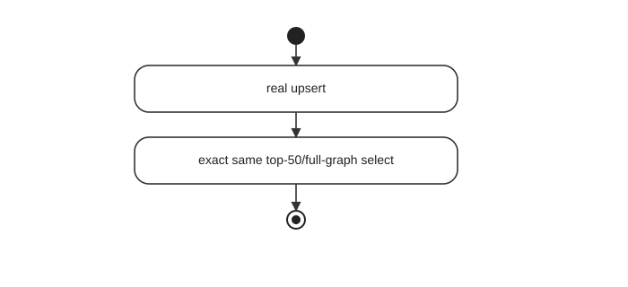
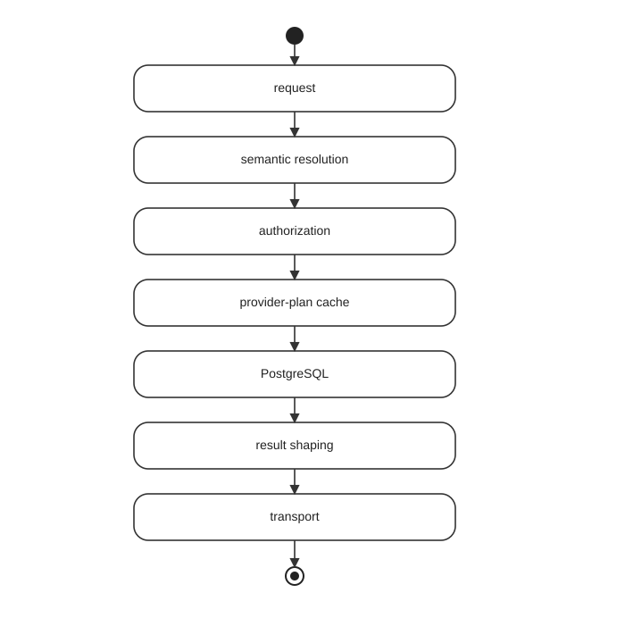

# CoffeeBeanery Performance Benchmark

This benchmark is the reproducible performance harness for the CoffeeBeanery graph workload. It compares Foundgine with Hot Chocolate + EF Core against the same PostgreSQL fixture and the same GraphQL-shaped workloads.

## Current findings

The supplied 2026-08-13 baseline shows three important results:

1. **Foundgine's query path is currently very strong on the tested graph.** At concurrency 32, Foundgine reaches 2,781.6 RPS without the provider-plan cache and 3,012.6 RPS with it, versus 156.7 RPS for Hot Chocolate + EF Core. Foundgine also uses substantially less measured API-container memory and CPU in this workload.
2. **Mutation is competitive, not universally faster.** At concurrency 32/batch 50, Hot Chocolate + EF Core reaches 86,955 logical mutations/s, Foundgine no-cache reaches 69,675, and Foundgine with the provider-plan cache reaches 81,910. Foundgine uses materially less measured API-container CPU and memory.
3. **Upsert + select is the main next target.** The benchmark now performs a real `upsertCustomer` against deterministic existing rows and then executes the exact same top-50/full-graph query used by the standalone query workload. This corrected workload must be rerun before new upsert conclusions are published.

These are workload-specific observations, not universal performance claims. See the full [checked-in benchmark reports](reports/query/).

## Benchmark matrix

- PostgreSQL fixture: 1,000 customers, 4,000 relationships, 12,000 contracts, 48,000 transactions.
- Query: top 50 customers with the full `Customer -> Relationship -> Contract -> Transaction` graph.
- Whole-graph mutation: nested graph create.
- Upsert + select: real upsert of existing deterministic customer rows followed by the exact same top-50/full-graph query.
- Concurrency: configurable; the curated baseline uses 1, 8 and 32.
- Mutation/upsert batch sizes: 1, 10 and 50.
- Warm-up: 3 seconds.
- Measurement: 10 seconds.
- Request timeout: 5 seconds.
- Latency: p50, p95, p99.
- Throughput: HTTP RPS and logical/s where batching applies.
- Docker metrics: API-container CPU and memory.

## Important workload semantics

### Query

The standalone query is the canonical read workload. The same full graph is used by the corrected upsert + select workload.

### Mutation

A batch of 50 means one HTTP request represents 50 independent logical mutations. Therefore request RPS and logical/s answer different questions and both are reported.

### Upsert + select

The combined workload is one measured client operation:



The stopwatch spans both HTTP calls. The upsert targets existing deterministic customers using `CustomerKey` as the conflict identity. This prevents the workload from degenerating into repeated inserts and ensures the following select reads the same graph shape as the standalone query benchmark.

Older benchmark rows labelled "Upsert + select" that actually used `createCustomer` are historical diagnostics and must not be mixed with the corrected baseline.

## Cache model

The current warm Foundgine configuration caches the **provider execution plan**. It does not cache database results.

That distinction matters:



The next cache experiments should add a **result cache** and measure hit rate, hit/miss latency, CPU, memory and PostgreSQL load. A result-cache hit can potentially avoid database execution and much of the downstream materialization cost, which is a fundamentally different optimization from caching the provider plan.

The benchmark should also add a **FASTER-backed cache provider** as a concrete alternative. FASTER is a future experiment, not a performance claim.

## Run

From `src/csharp/benchmarks/CoffeeBeanery.Performance`:

```powershell
Set-ExecutionPolicy -Scope Process -ExecutionPolicy Bypass
.\run-benchmarks.ps1
```

The query, mutation and update pipelines can also be run independently.

The load test accepts:

```text
BENCHMARK_CONCURRENCY=1,8,16,32,64
BENCHMARK_BATCH_SIZES=1,10,50
BENCHMARK_WARMUP_SECONDS=3
BENCHMARK_DURATION_SECONDS=10
```

## Interpreting the numbers

- **RPS** = completed HTTP requests per second.
- **logical/s** = RPS × logical batch size.
- Latency is per HTTP request. A batch-50 request therefore has one latency sample representing all 50 logical operations in that request.
- Docker CPU is expressed as a percentage across logical CPUs, so values above 100% are normal.

Do not compare batch sizes using HTTP RPS alone.

## Where to go next

The next benchmark cycle should answer four questions:

1. How does the corrected real upsert + full-graph refetch compare across providers?
2. At what payload size does result caching become valuable?
3. What is the effect of plan cache + result cache together?
4. Does a FASTER-backed cache change throughput, memory or PostgreSQL pressure enough to justify its complexity?

For the full findings, limitations and proposed experiments, see [the checked-in benchmark reports](reports/query/).


## Current benchmark status — 2026-08-15

The latest confirmed benchmark baseline is documented in [`reports/query/`](reports/query/).

The current evidence shows:

- Hot Chocolate + EF Core remains substantially faster for the measured top-50 query workload.
- Foundgine's whole-graph mutation path is substantially more competitive.
- Provider-plan caching improves the available lower-concurrency mutation measurements, but it is not a universal end-to-end optimization.
- Performance and PostgreSQL E2E correctness results are tracked separately.
