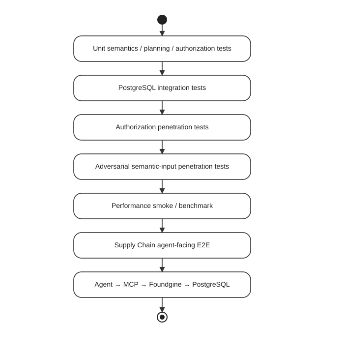

# Foundgine Supply Chain — Advanced Sample

A reproducible end-to-end supply-chain reference application exercising the Foundgine layers from an agent-like bot through MCP, semantic modeling, authorization, planning, execution and PostgreSQL.

> **New here?** This README covers *how to run it*. For *why it's built this
> way* — claims/authorization, high-assurance read scenarios, ambiguity
> ("grounding") resolution, retrieval strategies, and adversarial security
> testing, each tied to the exact test files that prove it — see
> [`docs/00-Overview-And-Setup.md`](./docs/00-Overview-And-Setup.md).

## Flow

AI agent bot → MCP → Foundgine capability boundary → semantic model → authorization → semantic planner → execution service → Npgsql → PostgreSQL.

The bot supports up to five customer identities plus Bob, Carol, Dave and Admin, and deliberately mixes valid, invalid and unauthorized operations. The benchmark verifies that denied requests do not mutate PostgreSQL and that successful mutations produce the expected state. The execution path now explicitly lowers semantic plans to Foundgine ExecutionIR before the PostgreSQL boundary, with a plan fingerprint included in receipts.

### Agent HTTP surface

The Semantic MCP API also exposes a plain JSON agent surface:

- `GET /foundgine/capabilities` — semantic entities, fields and relationships available to the authenticated actor.
- `POST /foundgine/execute` — accepts an open semantic intent (`rootEntity` + `select`) and lets Foundgine resolve, authorize, plan, and execute it.

The HTTP request body is **not** an authority source: actor identity is resolved from the ASP.NET authenticated principal. For local runs without authentication infrastructure, set the server-side `FOUNDGINE_DEMO_ACTOR` environment variable; callers cannot choose that value per request. Mutation capabilities that require replay protection, including `place_order`, require an explicit `idempotencyKey`.

## Actors

- Alice — Customer; own orders/customer-visible product and shipment reads; create/cancel own orders.
- Bob — Customer Service / Purchasing; customer/order/shipment reads, order cancellation, and the ambiguity-resolution `find_top_supplier_overdue_orders` capability (see below).
- Carol — Warehouse Operator; inventory and shipment operations.
- Dave — Procurement; suppliers/products/inventory operations.
- Admin — unrestricted.

## First vertical slice

`PlaceOrder` is the high-assurance mutation:

1. actor authorization
2. customer ownership check
3. product resolution
4. positive quantity validation
5. inventory availability check
6. server-side price calculation
7. atomic order + order_items + inventory decrement
8. idempotency/replay protection
9. receipt/evidence

Queries additionally exercise relationship traversal such as Customer → Orders → OrderItems → Product and Product → Supplier/Category/Inventory.

## Current coverage

MCP capabilities include capability discovery, customer/order/product/shipment reads, inventory reads and writes, supplier/product/customer listing, order creation/cancellation, shipment creation/status updates, the ambiguity-resolution `find_top_supplier_overdue_orders` capability, and the high-assurance `PlaceOrder` transaction. Order fulfillment records its warehouse allocation so cancellation restores inventory to the correct warehouse.

## Ambiguity resolution: "top supplier in `<state>`"

The [Foundgine walkthrough](../../docs-site/walkthrough/index.html) traces one request — *"show me overdue purchase orders from our top supplier in Texas"* — through every layer, including the step where **"top supplier" is not a database key** and has to be resolved through ranked candidates and evidence before anything downstream may execute. `find_top_supplier_overdue_orders(actor, state, supplierName?)` brings that exact case into this benchmark, and the seeded fixture is built so all five of its outcomes are exercised:

| `state` / args                         | Suppliers                                                | Outcome                                                                                                                                                                                                              |
| --------------------------------------- | --------------------------------------------------------- | ------------------------------------------------------------------------------------------------------------------------------------------------------------------------------------------------------------------ |
| `TX`                                    | Acme Industrial (482,000) > Globex Components (210,000)    | **Calculated evidence → execution.** The top candidate is unambiguous, so resolution binds the graph to Acme, authorizes it, and executes the overdue-purchase-order query, returning rows plus evidence (rank, margin over the runner-up, plan fingerprint). |
| `CA`                                    | Northstar Supply (300,000) = Southline Parts (300,000)      | **Candidates, no assurance → ask, don't guess.** The two suppliers tie for "top", so resolution stops before authorization or execution and returns `status: "clarification_needed"` with the tied candidates and suggested refinements (name the supplier, give a tiebreak criterion, narrow the region). Evidence: `strategy: "relational"`. |
| `NY`                                    | none seeded                                                | **No candidates at all.** Returns `status: "not_found"` — there is nothing to resolve, so nothing is authorized or executed either.                                                                                 |
| `CA` + `supplierName: "Northstar Supply"` | same tie as above, but the caller now names one directly     | **Closing the loop.** The agent has already been told the candidates are tied and comes back with a specific name instead of leaving Foundgine to guess. The name is validated against the real candidate set and, once matched, resolves and executes exactly like the `TX` case, with `resolvedBy: "explicit-name"`. |
| `TX` + `supplierName: "Acme Industial"` (typo) | Acme Industrial exists, but the name doesn't match exactly | **Approximate retrieval → still ask, don't guess.** An exact match fails, so `SupplyChainExecutionService.TryApproximateSupplierMatchAsync` tries `Fuzzy` (`pg_trgm` similarity), then `FullText`, then — if `FOUNDGINE_POSTGRES_PGSEARCH=1` — `Search` (pg_search/BM25), in that order, stopping at the first strategy that turns up anything. A hit still returns `status: "clarification_needed"` (never an auto-resolve) with `evidence.strategy` naming which one matched and a `score`-annotated candidate list, so the caller closes the loop the same way as the tie case above. If none of the three find anything, it falls through to `not_found` with `strategiesTried` listing what was actually attempted. See [`04-Retrieval-Strategies.md`](docs/04-Retrieval-Strategies.md#find_top_supplier_overdue_orders-own-fallback-a-lighter-cousin-of-postgresretrievalcandidatesource) for how this differs from `PostgresRetrievalCandidateSource`. |

Every `resolved` response also demonstrates field-level authorization from step 7 of the walkthrough: `Supplier.NegotiatedCost` is a commercially sensitive field that is stripped from the response — and listed under `deniedFields` — for every actor except Admin, regardless of the fact that the capability call itself was allowed.


### Weighted alias evidence

The advanced semantic contract also exercises the new **weighted alias evidence**
feature end-to-end. The same concrete vocabulary used by the ambiguity example
now carries application-declared evidence weights:

| Declaration | Example weight | Scope |
|---|---:|---|
| `Supplier → Vendor` / `Seller` | 95 / 90 | Entity alias |
| `Supplier.Country → State` | 85 | Field alias |
| `PurchaseOrder → PO` / `POs` / `Buy` / `Buys` | 100 / 95 / 90 / 85 | Entity aliases |
| `PurchaseOrder.ExpectedArrival → DueDate` | 90 | Field alias |
| `PurchaseOrder.supplier → vendor` | 85 | Relationship alias |

`AliasWeightEvidenceGate` treats these values as **application-declared
evidence strength**, not retrieval scores and never as authority. The feature is
active only for the aliases actually used by the current lexical-grounding path.
Entity, field, and relationship evidence remain separate scopes: a `50` weight
on `Supplier.State` is **50 for that field only**, never `50` for the Supplier
table/entity. It therefore cannot satisfy an entity-level minimum by being
averaged into the entity.

If the model was already established with certainty earlier in processing, its
**model-level evidence is 100**. That 100 does not inflate a field or relationship
weight. Every grounded scope is checked independently against the configured
minimum. With no lexical grounding, the weight feature is inert.

The advanced tests cover the feature at both contract and evidence boundaries:
AOT propagation of weights, entity/field/relationship declarations, optional
weights, `1`/`100` boundaries, invalid `0`/`101` values, mixed weighted and
unweighted aliases, threshold equality, violating entities, no-weight models,
and preservation through the frozen semantic snapshot. This is deliberately
separate from authorization: **weight can strengthen evidence about vocabulary;
it cannot create or expand a capability.**


The agent workload calls this capability with a random choice among all five shapes above on each occurrence, so a single run exercises every outcome. Bob (purchasing/customer service) and Admin are authorized for it; every other actor is expected to be denied at the MCP boundary, same as the rest of this benchmark's authorization matrix.

### Other cases worth adding later

A few more walkthrough-shaped cases that would extend this further, not yet implemented:

- **Stale authorization binding.** Simulate an actor's role or grant changing between plan binding (step 8) and execution (step 10-11), and assert the fingerprint mismatch fails the request closed instead of running a stale decision.
- **Near-tie below a confidence threshold.** Today "ambiguous" (the tie case) means an exact numeric tie on `total_order_value`. A more realistic case is two candidates close enough (e.g. within 5%) that guessing is risky even without an exact tie — worth its own threshold-based `clarification_needed` variant, distinct from the approximate-name-match case above (that one is about a misspelled *string*, this one would be about closeness in a *ranking value*).
- **Multi-field ambiguity.** Combine an ambiguous supplier with an ambiguous product/category reference in the same request, to check that the graph carries and resolves more than one candidate node at once.

## Run

```powershell
cd src/csharp/samples/Foundgine.SupplyChain.Advanced
$env:SUPPLY_CHAIN_CUSTOMERS="5"
$env:SUPPLY_CHAIN_STEPS="25"
$env:SUPPLY_CHAIN_SEED="20260823"
./run-supply-chain.ps1
```

The runner starts PostgreSQL and the Foundgine MCP service, seeds the graph, executes a stochastic agent workload, and writes `reports/supply-chain-report.json` and `reports/supply-chain-report.md`.
It then runs the existing `Foundgine.SupplyChain.PenTest` GraphQL and MCP penetration-test cases against the **same PostgreSQL instance** and merges their xUnit TRX timings into the same JSON/Markdown report. This avoids maintaining a second copy of the security scenarios while making every PenTest case measurable in the E2E evidence.

## Publish the report to the website

After a successful run, publish the generated report into the website asset folder:

```powershell
./publish-supply-chain-report.ps1
```

This copies the JSON and Markdown report to `docs-site/assets/agent-benchmark/supply-chain/` and writes a publication manifest. The website page at `docs-site/agent-benchmark/supply-chain/index.html` reads the JSON directly and renders the latest published run.


## How this fits into the Foundgine story

The advanced Supply Chain sample is deliberately the **end of the story**, not the beginning. It takes the lower-level guarantees already tested by the repository and places them in a realistic agent-facing business workflow:



This advanced sample answers a different question from a raw throughput benchmark: **can an application expose useful business capabilities to an agent without handing the agent authority over the application's data-access and execution rules?**

### What is inside the boundary

The agent chooses a capability and supplies structured arguments. MCP exposes the application capability surface. Foundgine resolves the request against the semantic model, applies authorization and validation, builds the semantic plan, lowers it through ExecutionIR, and hands the executable boundary to the provider. PostgreSQL remains the system of record.

The advanced application deliberately exercises the failure paths as well as successful paths. Unauthorized or invalid requests are expected to fail, and the benchmark checks that rejected operations do not create unintended database state.

### Verification status

The repository CI treats the following as release-quality gates: **unit tests, PostgreSQL integration tests, authorization penetration tests, adversarial semantic-input tests, and a real performance smoke test**. The Supply Chain E2E is an additional stateful product benchmark. See [`VERIFY-GATES.md`](VERIFY-GATES.md) for the exact gate definitions and local commands.

Do not read the Supply Chain report as a replacement for those gates. It is the final application-level demonstration that brings them together.

## `Semantic/` — the architectural proving ground

`Semantic/` contains the advanced semantic proving ground. It stays inside this sample so the repository has one Supply Chain starter and one Supply Chain advanced sample rather than a collection of overlapping semantic samples. It is a separate, self-contained project (own `.sln`, own `Foundgine.SupplyChain.Advanced.csproj`, own CI job) rather than sharing the bot/MCP/agent code above — it tests a different layer:

- **Retrieval strategies** — dedicated coverage for every `RetrievalStrategy` PostgreSQL provider mechanism: `Fuzzy` (`pg_trgm`), `FullText` (`tsvector`), `Search` (optional `pg_search`/BM25), and `GraphSimilarity` (optional Apache AGE). No other sample in the repository exercises these.
- **Weighted alias evidence** (`Semantic/Tests/Grounding/SupplyChainAliasWeightTests.cs`) — AOT-preserved entity, field, and relationship alias weights plus threshold and fail-closed evidence-gate cases.
- **Grounding decisions** (`Semantic/Tests/Grounding`) — the unit-level case study behind [Grounding decisions](../../docs/GROUNDING-DECISIONS.md): ambiguity (`active supplier`), duplicate-evidence-is-not-ambiguity, unresolved/no-vocabulary, and `SemanticLexicalResolver.Ground`'s budget/timeout/cancellation fail-closed behavior — run directly against `SemanticLexicalResolver` with a fake candidate source, independent of any live retrieval provider or MCP round-trip. This is what the `find_top_supplier_overdue_orders` capability above exercises at the black-box, agent-facing level; `Semantic/Tests/Grounding` exercises the same resolver white-box, including budget/cancellation edge cases that have no equivalent when going through a full MCP round-trip.
- **Security invariants** — recursive graph traversal (`RecursiveSupplierRiskTests`), graph security boundary, open-intent mutation security, adversarial invariants, sensitive-field authorization, and an MCP authorization penetration suite, all against the sample's metadata-discovered semantic model. A separate two-entity manual builder example is included only to illustrate the alternative authoring path; it is not part of the application pipeline.

See `Semantic/README.md` and `Semantic/GUIDE.md` for the full architecture and authorization walkthrough, and `Semantic/Tests/` for the complete semantic test suite.

## HTTP execution boundary hardening

The Semantic MCP API also provides a plain JSON open semantic agent adapter. Its authoritative actor is resolved by the host, not supplied by the request body. The semantic request is passed through resolution and authorization before planning and SQL execution; there is no named-intent dispatch layer on this endpoint.
