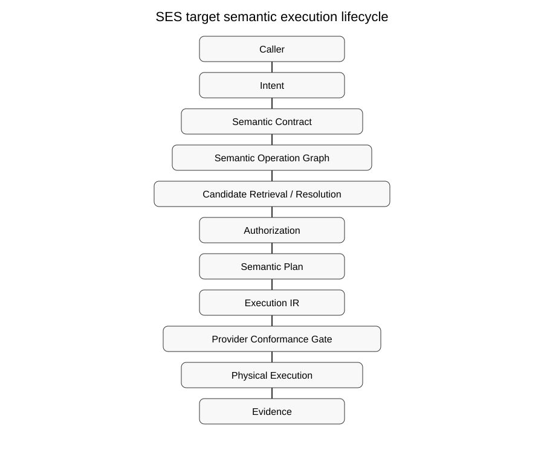

# Semantic Execution Standard (SES) — Forward Specification

**Status:** Draft 1.0 — architecture, critique, and future development specification.

This specification defines what a serious Semantic Execution System should become. It is intentionally **not** a reverse-engineered description of Foundgine. Foundgine is an informative reference implementation and experimentation vehicle; it is not the normative source of the architecture.

## The target architecture

*Normative diagram source: [`diagrams/01-canonical-lifecycle.puml`](diagrams/01-canonical-lifecycle.puml). The SVG is the checked-in rendering artifact; PlantUML source is authoritative.*

The central design claim is that **meaning, authority, and execution are separate artifacts**. A caller can propose intent; only the trusted semantic contract establishes meaning; authorization establishes authority; planning determines how authorized meaning is executed; the provider conformance gate prevents physical execution from violating the semantic/security contract.

## What changed from the previous document set

The previous documents were primarily descriptive: they explained concepts by extracting them from an existing implementation. This revision is deliberately more demanding:

1. **Normative target first.** Each specification states what a conforming system must provide, not merely what the current code appears to do.
2. **Explicit gaps.** Every major layer has a critique section identifying capabilities that are easy to omit, under-specified, or likely to fail at scale.
3. **Future development is part of the specification.** Missing protocol definitions, proofs, registries, interoperability rules, governance, conformance suites, and operational controls are treated as first-class work.
4. **No implementation is assumed complete.** A test passing in Foundgine is evidence, not proof of standard conformance.
5. **Acceptance criteria are mandatory.** Future work should close a requirement only when the specified observable behavior and tests exist.

## Specification family

| ID | Document | Primary question |
|---|---|---|
| SES-000 | Terminology and conformance | What exactly does conformance mean? |
| SES-001 | Architecture and trust boundaries | What must the system separate? |
| SES-002 | Canonical lifecycle | What is the required ordering? |
| SES-003 | Semantic contract | What is the authoritative meaning of the domain? |
| SES-004 | Operation graph | What is the canonical representation of an operation? |
| SES-005 | Operation algebra | What transformations are valid? |
| SES-006 | Retrieval and resolution | How does ambiguous language become deterministic meaning? |
| SES-007 | Traversal | How are graph paths bounded and authorized? |
| SES-008 | Authorization | What does it mean to authorize semantic meaning? |
| SES-009 | Provenance | How is authorization bound to executable artifacts? |
| SES-010 | Planning and rewrites | Which optimizations are safe and provable? |
| SES-011 | Execution IR | What exact artifact may cross into execution? |
| SES-012 | Provider conformance | How is physical execution proven faithful? |
| SES-013 | Mutations | How are high-assurance state changes modeled? |
| SES-014 | Plan caching | How can plans be reused without becoming stale authority? |
| SES-015 | Transports and agents | How do MCP, GraphQL, APIs and agents converge safely? |
| SES-016 | Resource governance | How is semantic complexity prevented from becoming DoS? |
| SES-017 | Evidence and observability | What must be provable after execution? |
| SES-018 | AOT and generated metadata | What can be compiled ahead without changing semantics? |
| SES-019 | Future development roadmap | What remains to be developed before maturity? |
| SES-020 | Formal data model | What are the typed normative artifacts and invariants? |
| SES-021 | State machines | How are retries, cancellation, approval, and failure represented? |
| SES-022 | Wire protocol | How do transports exchange semantic artifacts safely? |
| SES-023 | Versioning and compatibility | How do independently evolving implementations interoperate? |
| SES-024 | Authority and delegation | How is authority represented, attenuated, delegated, and revoked? |
| SES-025 | Provider capability profiles | How is provider semantic fidelity declared and verified? |
| SES-026 | Proof and attestation | How are semantic/security claims independently verified? |
| SES-100 | Conformance testing | What must every layer prove? |
| SES-101 | Test architecture | What fixtures and independent oracles are required? |
| SES-102 | Conformance matrix | How are requirements traced to tests? |
| SES-103 | Security conformance | What attacks must be resisted? |
| SES-104 | Future implementation gap matrix | What should be built next? |
| SES-105 | Portable vectors | How can implementations be compared? |
| SES-900 | Reference implementation profile | How should Foundgine relate to the standard? |

## Formalization status

This revision now separates three things that must not be conflated: **architecture**, **normative requirements**, and **implementation evidence**. The next development step is therefore not another architecture diagram; it is executable formalization: machine-readable schemas, canonical encodings, state/event registries, compatibility negotiation, authority algebra, provider profiles, proof formats, and portable conformance vectors.

The machine-readable requirement registry is `conformance/requirements.json`. It is intentionally small at this stage: it defines the root requirement vocabulary and MUST be expanded until every normative paragraph has a stable identifier.

## Global critique

A credible semantic execution architecture needs more than a good pipeline. The hard unsolved problems are **semantic determinism, proof-carrying authorization, provider fidelity, policy freshness, ambiguity management, resource economics, mutation correctness, cross-transport equivalence, interoperability, version negotiation, and independently verifiable conformance**.

A system should therefore be considered immature if it can demonstrate only happy-path queries. Production readiness requires adversarial, differential, concurrency, fault-injection, compatibility, and provider-fidelity evidence.

## Development principle

Every future feature should answer five questions before implementation:

1. What semantic contract does it add?
2. What new trust boundary does it introduce?
3. What invariant must never be violated?
4. What independent test can prove that invariant?
5. How does the feature interact with versioning, caching, authorization, providers, and resource limits?

## Diagrams

Every normative diagram MUST have a `.puml` source and a checked-in `.svg` artifact. PlantUML is the editable source of truth; SVG is the presentation artifact. `scripts/verify-diagrams.py` MUST fail on missing source/artifact pairs or broken Markdown references.

## Relationship to Foundgine

Foundgine is an **informative reference implementation/profile**. The standard must remain provider-neutral and must not require .NET, C#, PostgreSQL, SQL, GraphQL, MCP, EF Core, or any particular AI framework.

